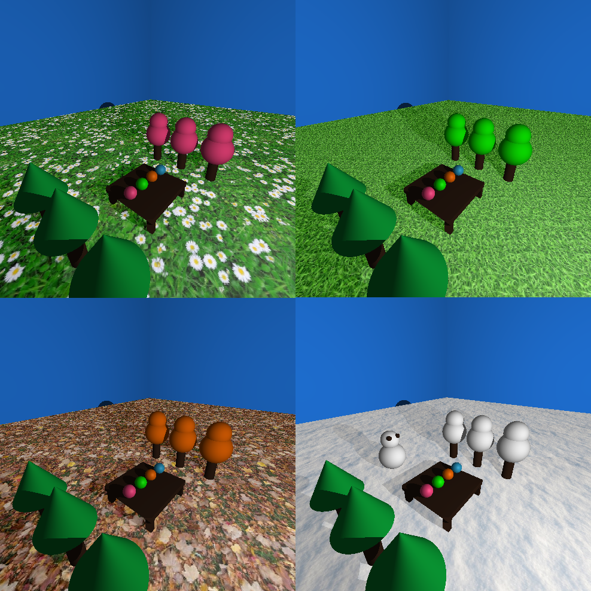

# Computação Gráfica
Professor: **Creto**  
Linguagem: **C++**
| Terça| Quinta |
| --- | --- |
| 10:00 - 12:00 | 10:00 - 12:00 |

$$I_{d} = cos(\vec{l}, \vec{n})(I_{F}@k_{d})$$

## Como rodar

Nem eu sei. Clico no botão do Visual Studio.  
Precisa das bibliotecas SDL e Eigen.