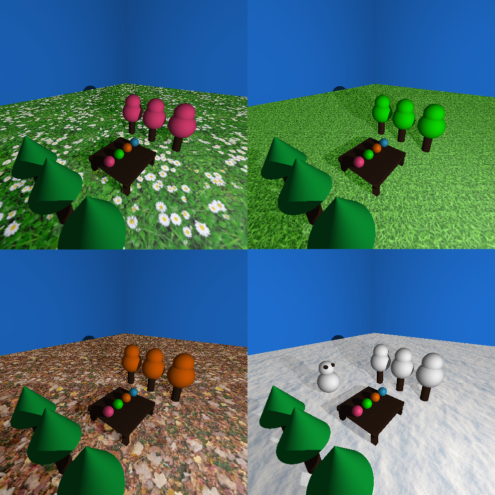

# Computação Gráfica

Linguagem: **C++**

$$I_{d} = cos(\vec{l}, \vec{n})(I_{F}@k_{d})$$

## Como rodar no Mac

Baixar bibliotecas SDL e Eigen.

Rodar o comando:
clang++ -std=c++17 main.cpp AmbientSource.cpp Camera.cpp Canvas.cpp Cilinder.cpp Cone.cpp Cube.cpp Plane.cpp PontualSource.cpp Ray.cpp Sphere.cpp Tensor.cpp TriangularFace.cpp CircularPlane.cpp Scene.cpp HitBox.cpp -o main \
-I/opt/homebrew/opt/sdl2/include \
-I/opt/homebrew/opt/sdl2_image/include \
-L/opt/homebrew/opt/sdl2/lib \
-L/opt/homebrew/opt/sdl2_image/lib \
-lSDL2 -lSDL2_image

Rodar segundo comando:
./main 
